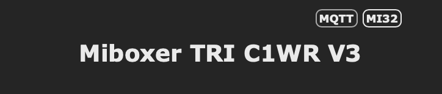
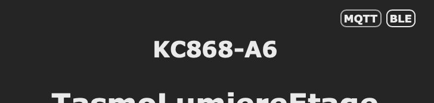

# Tasmota BLE/MI32 Status Indicator

This repository provides Berry code to display a BLE/MI32 status indicator in the top-right corner of your Tasmota WebUI.

## Overview

This code adds a small status indicator that shows whether your Tasmota device has BLE or MI32 support. It appears in the top-right corner of your Tasmota web interface.

## Screenshots

With MI32 support:


With BLE support:


## Installation

#### Manual installation 

- Download the `ble_status.be` file.
- Copy it to your ESP32 via Tasmota web interface (Console -> Manage File System)
- Enable it:
   ```
   br load('ble_status.be')
   ```

#### Automatic installation 
   - Paste this code in your ESP32 via Tasmota web interface (Console -> Berry Scripting Console)
   ```
   import path
   
   def download_file(url, filename)
     var cl = webclient()
     cl.begin(url)
     var r = cl.GET()
     if r != 200
       print('error getting ' + filename)
       return false
     end
     var s = cl.get_string()
     cl.close()
     var f = open(filename, 'w')
     f.write(s)
     f.close()
     return true
   end
   
   def start_ble_status_setup()
     var remote_url = 'https://raw.githubusercontent.com/Flobul/Tasmota-WebStatusBle/main/ble_status.be'
   
     if !download_file(remote_url, 'ble_status.be')
       return false
     end
   
     load('ble_status.be')
   end
   
   start_ble_status_setup()
   ```

To make the code run at startup, you can either:
- Rename the file to `autoexec.be`
- Add the code to your existing `autoexec.be`


### Load on boot

If you would like a fully berry solution to loading eWeLinkRemote, add the following line to autoexec.be

   ```
    tasmota.add_rule('Wifi#Connected', / -> load('ble_status.be'))
   ```

Otherwise, you can simply make a rule:

   ```
    Rule1 ON Wifi#Connected DO br load('ble_status.be') ENDON
   ```
Enable the rule:
   ```
    Rule1 1
   ```

## How it works

The code will:
1. Check for BLE support on your device
2. Display either "MI32", "BLE", or "No BLE" in the top-right corner of your WebUI
3. The indicator shows:
   - "MI32" if MI32 module is available
   - "BLE" if BLE support is detected in Tasmota features
   - "No BLE" if no BLE support is found

## Requirements

- Minimal Tasmota version: 14.6.0.2
- Tasmota firmware with Berry scripting support
- Optional: BLE or MI32 support in your Tasmota build

## License

This project is open source. Feel free to use and modify as needed.